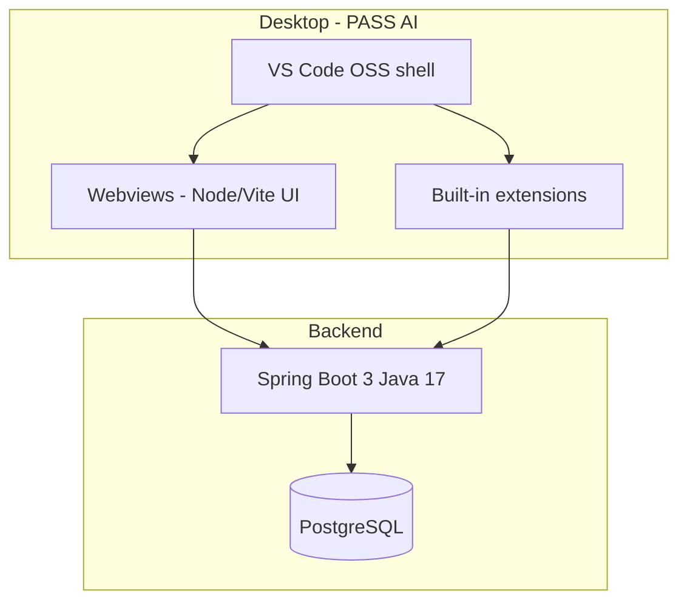

# PASS AI architecture

## Vision

PASS AI is a **standalone desktop IDE** (Electron, VS Code OSS) with optional **cloud/backend** services for accounts, AI routing, and team features—similar in distribution model to Cursor, but open source and PASS-branded.

## Desktop (current focus)

- Fork/build **microsoft/vscode** with custom `product.json` (`PASS AI`, `.pass-ai` data dir, `pass-ai` URL protocol).
- Icons and splash from `assets/branding/`.
- Bundled extension `pass-ai-welcome` for first-run experience (copy into `vscode/extensions` or package as VSIX during CI).

Build output is a normal Windows/macOS/Linux app—not a browser tab.

## Frontend (Node.js)

- `apps/web`: Vite + TypeScript for panels that load inside the IDE via webviews or a future Electron BrowserView.
- Shares API contracts with the Java backend (`/api/v1/*`).

## Backend (Spring Boot)

- `services/api`: REST API, JPA, PostgreSQL.
- Local dev: `infra/docker-compose.yml`.

## Next implementation steps

1. Run `desktop/scripts/setup-vscode.ps1` and complete first `yarn gulp vscode-win32-x64` build.
2. Wire `pass-ai-welcome` into the VS Code build (product `builtInExtensions` or manual copy).
3. Add auth + user schema in PostgreSQL.
4. **Agent panel:** Cline engine vendored at `vendor/cline` (junction), built with `desktop/scripts/build-pass-ai-agent.ps1`, UI in secondary side bar (`pass-ai-layout` + patched `auxiliarybar` manifest). LLM keys stay in the extension until `services/api` provides auth and routing.
5. Add AI proxy service and team auth in Spring Boot when ready.
